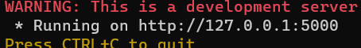
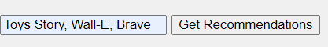
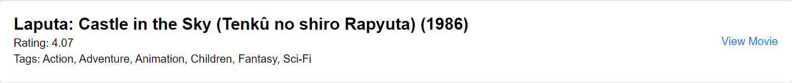
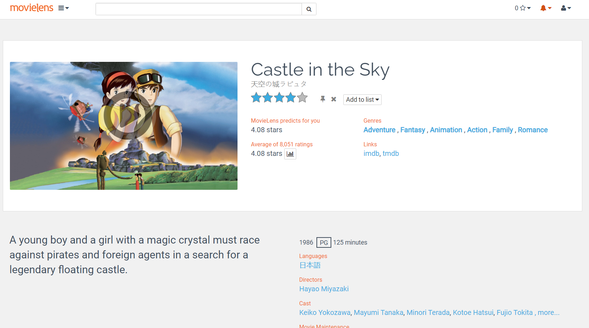

# Movie Recommendation System

## Table of Contents
1. Overview
2. Run the project
3. Implementation
4. Future Work

## Overview <a name="overview"></a>

The goal of this project is to create a platform that allows to easily find the ideal movie for a great evening. Indeed, I realized that I often spent more time looking for a movie than watching it. To solve this problem, I designed a personalized movie recommendation system, developed in Python and Flask, that uses the MovieLens database. This database contains information on more than 27,000 movies and more than 20 million ratings given by users.

## Run the project <a name="run-the-project"></a>

### Lunch

There is a `run.bat` file that allows you to launch (**IN ADMINISTRATOR**) the project from scratch. It will automatically install the necessary libraries for the project to function properly.

### See the project

After launching the `run.bat` file, all you have to do is click on the website as indicated below:




### Enter your film 

After clicking on the website, enter the names of movies (**THE ENGLISH TITLES**) and then press Get Recommendations.

Example:



### The Recommendations

You can now choose your next movie to watch.



By clicking on `View Movie`, you can learn more about the movie by landing on the MovieLens platform.



## Implementation <a name="implementation"></a>

The system is implemented as a Flask web application. The main part of the application is the `Movie` class, which represents a movie with attributes such as name, id, tags, link, and rating. The `MovieInit` function initializes the movies from a CSV file. The `load_average_ratings` function loads the average ratings for each movie from another CSV file.

The `get_movies_by_name` function takes a list of movie names and returns a list of `Movie` objects that have similar names. The `recommend_movies` function uses this list to find the most common genres among the movies, and then recommends other movies that have these genres and high ratings.

The application has a single route (`/`) that handles both GET and POST requests. If the request method is POST, the route function gets the movie names from the form data, finds the recommended movies, and displays them on the page. If the request method is not POST, the route function simply displays the home page without any movies.


## Future Work <a name="future-work"></a>

Currently, the system only uses movie names and genres to recommend movies. In the future, it could be improved to take into account other factors such as the user's past ratings, the popularity of the movies, and the ratings of similar users. Additionally, the user interface could be enhanced with features such as autocomplete for movie names, user accounts, and the ability to rate movies and save recommendations. 

This project is a great example of how you can use Python and Flask to build a simple but effective recommendation system. It demonstrates the power of data and algorithms in providing personalized experiences for users. Whether you're a movie buff looking for your next favorite film, or a developer seeking to learn more about recommendation systems, this project has something for you. Enjoy exploring it! 🎬🍿

```
Copyright (c) 2023 by Sephyroth
Permission is hereby granted, free of charge, to any person obtaining a copy of this software and associated documentation files (the "Software"), to deal in the Software without restriction, including without limitation the rights to use, copy, modify, merge, publish, distribute, sublicense, and/or sell copies of the Software, and to permit persons to whom the Software is furnished to do so, subject to the following conditions:

The above copyright notice and this permission notice shall be included in all copies or substantial portions of the Software.

THE SOFTWARE IS PROVIDED "AS IS", WITHOUT WARRANTY OF ANY KIND, EXPRESS OR IMPLIED, INCLUDING BUT NOT LIMITED TO THE WARRANTIES OF MERCHANTABILITY, FITNESS FOR A PARTICULAR PURPOSE AND NONINFRINGEMENT. IN NO EVENT SHALL THE AUTHORS OR COPYRIGHT HOLDERS BE LIABLE FOR ANY CLAIM, DAMAGES OR OTHER LIABILITY, WHETHER IN AN ACTION OF CONTRACT, TORT OR OTHERWISE, ARISING FROM, OUT OF OR IN CONNECTION WITH THE SOFTWARE OR THE USE OR OTHER DEALINGS IN THE SOFTWARE.
```
